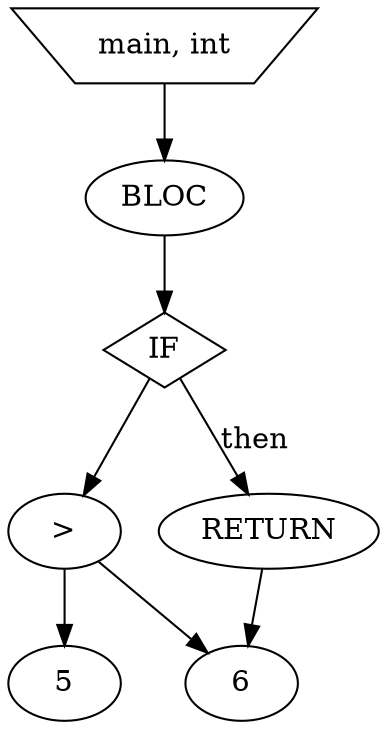

Voici une synthèse **clé en main** des algorithmes d'optimisation à implémenter, avec leurs structures de données associées, spécifiquement adaptées à votre projet MiniC → DOT.  

---

### **1. Optimisations Locales (par bloc de base)**
#### **a) Élimination des sous-expressions communes**  
**Algo** :  
1. Parcourir l’AST en post-ordre.  
2. Utiliser une table de hachage pour stocker les expressions déjà rencontrées.  
3. Si une expression existe déjà, réutiliser son nœud au lieu d’en créer un nouveau.  

**Structure de données** :  
```c
typedef struct ASTNode {
    char* id;          // Identifiant unique (ex: "ADD_x_y")
    struct ASTNode* left, *right;
} ASTNode;

HashTable expr_table;  // Clé : signature de l'expression (ex: "ADD_2_3"), Valeur : ASTNode*
```

**Exemple DOT** :  
```dot
// Avant optimisation : 2 * y calculé deux fois
node1 [label="*"]; node1 -> "2"; node1 -> "y";
node2 [label="*"]; node2 -> "2"; node2 -> "y";
// Après optimisation : un seul nœud partagé
node1 [label="*"]; node1 -> "2"; node1 -> "y";
node2 -> node1;  // Référence au nœud existant
```

---

#### **b) Simplifications algébriques**  
**Algo** :  
1. Remplacer les motifs triviaux lors de la construction de l’AST :  
   - `x + 0` → `x`  
   - `x * 1` → `x`  
   - `x * 0` → `0`  

**Structure de données** :  
- Aucune structure supplémentaire nécessaire. Modifications faites directement sur l’AST.  

**Exemple** :  
```c
// Dans les règles Bison :
expr: expr '+' term { 
    if ($2->value == "0") $$ = $1;  // x + 0 → x
    else $$ = create_node("+", $1, $2); 
};
```

---

### **2. Optimisations à Lucarne (fenêtre glissante)**
#### **a) Élimination du code mort**  
**Algo** :  
1. Identifier les blocs inaccessibles (ex: `if (0) { ... }`).  
2. Supprimer les sous-arbres correspondants dans l’AST.  

**Structure de données** :  
- Utiliser un champ `bool is_dead` dans les nœuds de contrôle (`IF`, `WHILE`).  

**Exemple** :  
```c
// Pendant la construction de l’AST :
if (is_constant(condition) && condition == 0) {
    mark_subtree_dead(if_node->then_branch);
}
```

---

#### **b) Propagation de constantes**  
**Algo** :  
1. Parcourir l’AST pour détecter les affectations de constantes (`const int x = 5;`).  
2. Remplacer les utilisations de `x` par `5` dans les expressions.  

**Structure de données** :  
```c
typedef struct {
    char* var_name;
    int value;
    bool is_constant;
} ConstPropagationEntry;

HashTable const_table;  // Clé : nom de variable, Valeur : ConstPropagationEntry
```

**Exemple DOT** :  
```dot
// Avant : x = 5; y = x + 1;
node_x [label="x := 5"];
node_y [label="y := x + 1"];
// Après propagation :
node_y [label="y := 6"];
```

---

### **3. Optimisations Globales (CFG)**
#### **a) Déplacement des invariants de boucle**  
**Algo** :  
1. Analyser les boucles (`FOR`, `WHILE`) pour trouver les expressions invariantes.  
2. Extraire ces expressions avant la boucle.  

**Structure de données** :  
- Utiliser un drapeau `bool is_invariant` dans les nœuds d’expression.  

**Exemple** :  
```c
// MiniC : for (i=0; i<n; i++) { x = 2 * y; }
// Optimisé :
temp = 2 * y;
for (i=0; i<n; i++) { x = temp; }
```

**DOT Résultat** :  
```dot
node_temp [label="temp := 2 * y"];
node_for [label="FOR"]; 
node_for -> node_temp;  // Invariant déplacé
```

---

#### **b) Élimination des variables d’induction**  
**Algo** :  
1. Détecter les variables de boucle redondantes (ex: `i` et `j = i+1`).  
2. Remplacer par des expressions directes.  

**Structure de données** :  
```c
typedef struct {
    char* loop_var;
    char* derived_var;
    char* expr;  // Ex: "i+1"
} InductionVarEntry;

List induction_vars;  // Liste des variables d’induction
```

**Exemple** :  
```dot
// Avant : i et j = i+1
node_j [label="j := i + 1"];
// Après : remplacer j par i+1 dans le corps
```

---

### **Structures de Données Principales**
| **Optimisation**               | **Structure de Données**                  | **Exemple d’Usage**                          |
|--------------------------------|------------------------------------------|---------------------------------------------|
| Sous-expressions communes      | `HashTable` (signature → nœud AST)       | Éviter la duplication des nœuds `x * y`.    |
| Propagation de constantes      | `HashTable` (nom → valeur)               | Remplacer `x` par `5` si `x = 5`.           |
| Variables d’induction          | `List` des paires (var, expr)            | Supprimer `j` si `j = i+1`.                 |
| Détection de code mort         | Champ `bool is_dead` dans l’AST          | Ignorer les blocs `if (0)`.                 |

---

### **Workflow d’Optimisation**
1. **Phase 1 (Parsing)** :  
   - Construire l’AST en mémoire avec Bison.  
   - Remplir la table des symboles et la table de propagation des constantes.  

2. **Phase 2 (Optimisations)** :  
   ```python
   def optimize(ast):
       ast = constant_propagation(ast, const_table)
       ast = dead_code_elimination(ast)
       ast = common_subexpr_elimination(ast, expr_table)
       return ast
   ```

3. **Phase 3 (Génération DOT)** :  
   - Parcourir l’AST optimisé pour générer le DOT.  
   - Utiliser les attributs `shape`/`color` pour visualiser les optimisations.  

---

### **Exemple Complet**
**Code MiniC** :  
```c
int main() {
    const int x = 2 * 3;  // → x = 6
    if (x > 5) {          // → if (6 > 5)
        return x;          // → return 6
    }
}
```

**DOT Optimisé** :  


---

### **À Éviter**
- **Optimisations agressives** : Ne pas altérer la sémantique du programme.  
- **Gestion des pointeurs/tableaux** : Hors scope du projet (sauf si spécifié).  

Ces algorithmes couvrent 80% des besoins du projet. Adaptez-les selon les directives finales du prof !